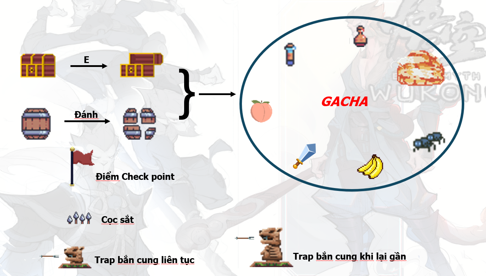

<h1>Bài tập lớn : Lập trình hướng đối tượng (IT3100)</h1>

Một tựa game 2D hành động, vượt màn, xây dựng bằng ngôn ngữ Java kết hợp JavaFx. Người chơi sẽ điều khiển nhân vật Tôn ngộ không đánh bại các yêu quái để trở nên mạnh hơn và tiêu diệt boss ở mỗi màn. Game có giao diện menu, âm thanh, và kết bằng video cuối game.

<h2>Tính năng nổi bật</h2>
<ul>
  <li><h3>Di chuyển và sử dụng kĩ năng: </h3>
      
  </li>
  <li><h3>Hệ thống vật phẩm: </h3>
      
Các vật phẩm có thể nhặt được đa dạng như đào, chuối, kiếm, lọ hp, lọ mana,... với những công dụng khác nhau

      
  </li>
  <li><h3>Hệ thống quái vật và map đa dạng: </h3>
      
Các màn chơi và boss được bố trí theo Kim, Mộc, Thuỷ, Hoả, Thổ

      
  </li>
  
</ul>
